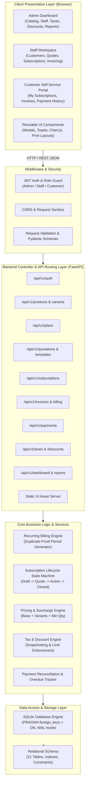

# System Architecture Diagram

```mermaid
flowchart TD
    subgraph ClientLayer ["Client Presentation Layer (Browser)"]
        UI_Admin["Admin Dashboard<br/>(Catalog, Staff, Taxes, Discounts, Reports)"]
        UI_Staff["Staff Workspace<br/>(Customers, Quotes, Subscriptions, Invoicing)"]
        UI_Customer["Customer Self-Service Portal<br/>(My Subscriptions, Invoices, Payment History)"]
        UI_Components["Reusable UI Components<br/>(Modals, Toasts, Chart.js, Print Layouts)"]
    end

    subgraph APILayer ["Backend Controller & API Routing Layer (FastAPI)"]
        AuthRouter["/api/v1/auth"]
        ProductRouter["/api/v1/products & variants"]
        PlanRouter["/api/v1/plans"]
        QuoteRouter["/api/v1/quotations & templates"]
        SubRouter["/api/v1/subscriptions"]
        InvoiceRouter["/api/v1/invoices & billing"]
        PaymentRouter["/api/v1/payments"]
        TaxDiscRouter["/api/v1/taxes & /discounts"]
        DashRouter["/api/v1/dashboard & reports"]
        StaticServer["Static UI Asset Server"]
    end

    subgraph SecurityLayer ["Middleware & Security"]
        JWTMiddleware["JWT Auth & Role Guard<br/>(Admin / Staff / Customer)"]
        CORSHeader["CORS & Request Sanitize"]
        RateLimiter["Request Validation & Pydantic Schemas"]
    end

    subgraph ServiceLayer ["Core Business Logic & Services"]
        BillingEngine["Recurring Billing Engine<br/>(Duplicate-Proof Period Generator)"]
        LifecycleEngine["Subscription Lifecycle State Machine<br/>(Draft -> Quote -> Active -> Closed)"]
        PricingEngine["Pricing & Surcharge Engine<br/>(Base + Variants + Min Qty)"]
        TaxDiscountEngine["Tax & Discount Engine<br/>(Snapshotting & Limit Enforcement)"]
        PaymentLedger["Payment Reconciliation & Overdue Tracker"]
    end

    subgraph DataLayer ["Data Access & Storage Layer"]
        DBEngine["SQLite Database Engine<br/>(PRAGMA foreign_keys = ON, WAL mode)"]
        DBTables["Relational Schema<br/>(21 Tables, Indexes, Constraints)"]
    end

    ClientLayer -->|HTTP / REST JSON| SecurityLayer
    SecurityLayer --> APILayer
    APILayer --> ServiceLayer
    ServiceLayer --> DataLayer
    DataLayer --> DBTables
```
